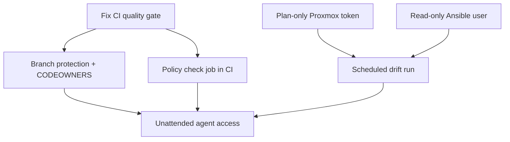

# Agent Environment Gaps

The environment described in [[Agent Environment]] is **not yet in place**. These are open
items, not claims about current state.

> [!caution] Close these before granting any agent scheduled or unattended access to the hosts.

- [x] **The quality gate had never passed.** `Ansible Lint` failed on all 19 runs on `master`.
      Fixed: `roles_path` configured, collections declared and installed in CI, `production`
      profile findings resolved. **Still blocks every other item here until it reaches
      `master`.** → [[CI Quality Gate]]
- [ ] **No plan-only Proxmox token documented.** `docs/terraform-proxmox-api-token.md` describes
      only the full-write operator token. Add the `terraform-planner` role and the `agent@pve`
      user. → [[Plan-Only Proxmox Token]]
- [ ] **No branch protection on `master`.** CI runs, but nothing prevents a direct push or a
      merge with a red gate. Require the quality gate and at least one review.
- [ ] **No `CODEOWNERS`.** The storage policy, the SSH key policy, and `terraform/` should
      require named human review on change.
- [ ] **CI checks style, not policy.** `ansible-lint` and `terraform validate` do not catch a ZFS
      datastore on consumer hardware, `ssh_keys_enforce: true`, or a removed `prevent_destroy`.
      Those are the changes worth failing a build over — add a policy check job.
- [ ] **No scheduled drift run.** The read-only checks exist but are only run by hand, which means
      they are run *after* an incident rather than before one.
- [ ] **No read-only Ansible user defined.** `ansible/group_vars/proxmox_hosts.yml` configures the
      admin user; there is no unprivileged, sudo-less agent user. → [[Rights Not Prompts]]

## Ordering

## Related

- [[Agent Environment]]
- [[CI Quality Gate]]
- [[Plan-Only Proxmox Token]]
- [[Rights Not Prompts]]
